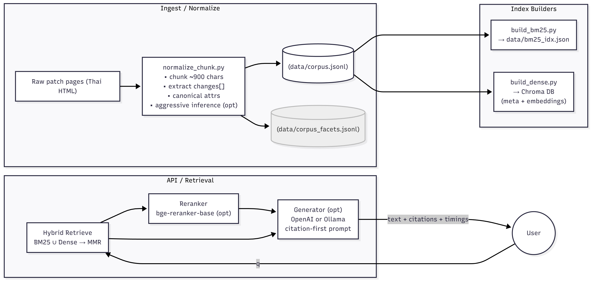
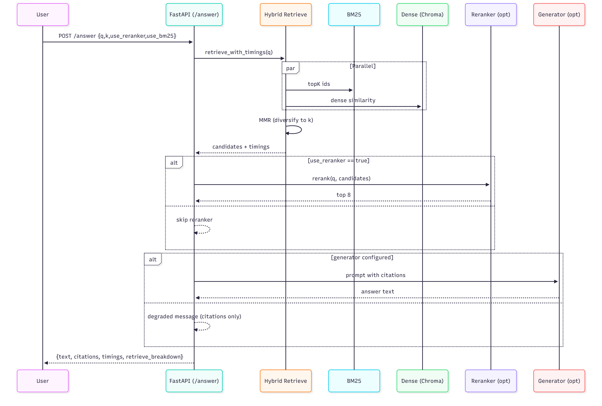

#### rag-game-patch-th
# Hybrid Retrieval ROV Game Patch TH (RAG 2.0)

> **Independent project — not affiliated with, endorsed by, or associated with Garena.** "Arena of Valor" / "RoV" and related names and marks belong to their respective owners. This repository contains an independently built retrieval pipeline and does not redistribute Garena's content.

Multilingual RAG system for **Garena** patch notes (ไทย).  
Raw patch pages are **normalized into structured chunks** (attributes like *คูลดาวน์/ความเสียหาย…*, old→new, direction, units), then indexed for **hybrid retrieval (BM25 + dense)**, reranked (**bge cross-encoder**), and answered by a lightweight generator (OpenAI or local Ollama).  
Deterministic normalization + fast retrieval + citations-first prompting.

## Data & source terms

This project was originally prototyped against Thai ROV patch notes. Those pages are governed by source terms that restrict automated copying and redistribution, so **the scraped corpus and derived indexes are intentionally not included** in this repository. The ingestion code is provided for reference, but you should supply your own data from a source you're authorized to use (an official API, a licensed/open dataset, or content you have permission to process). A small synthetic sample (`data/sample_corpus.jsonl`) is included so the pipeline runs out of the box.

> "Winning Combo": final quality & speed come from the **whole** stack, not just the LLM.
> - **Retriever (Dense):** `BAAI/bge-m3` (best) or `intfloat/multilingual-e5-small/base` (lightweight)
> - **Reranker:** `BAAI/bge-reranker-base`
> - **Generator:** `qwen2.5:3b-instruct-q4_K_M` (Ollama) or `gpt-4o-mini` (OpenAI)
---
## What this does
- Normalize Thai patch pages into **consistent chunks** with structured diffs:
  - `changes[].attr / old / new / unit / direction / pattern`
  - Canonical attributes: `คูลดาวน์`, `ความเสียหาย`, `พลังชีวิต`, `มานา`, `ระยะเวลา`, etc.
- Build **BM25** (lexical) + **Dense** (semantic) indexes.
- **Hybrid retrieval** with **MMR** dedup + optional **rerank** (cross-encoder).
- Serve a **FastAPI** endpoint `/answer`:
  - Returns **citations** (IDs + URLs), **timings breakdown**, and (if configured) an LLM **answer**.
  - If no LLM configured, returns a “**(degraded) model error**” string but still useful citations + timings.
---

## What I delivered

- Production-ready **normalizer** with `--aggressive-infer` (≈96–97% attr coverage).
- **Index builders** (BM25 JSON, Chroma DB) and **hybrid retrieval**:
  - Query timings: `q_embed_ms`, `dense_query_ms`, `bm25_ids_ms`, `bm25_fetch_ms`, `mmr_ms`.
- **Reranker** warmup + **API** with `/health` + graceful degraded mode.
- Minimal **bench** client and **evaluation hooks**.
- Disk-light defaults for Codespaces: small embedder, caches to `/tmp`.
---

## Why this approach

- Thai patch notes are semi-structured with **numbers & diffs**; accuracy needs **retrieval + rerank**.
- **Hybrid retrieval** is stronger than dense-only or lexical-only (mixed Thai/English, entity names, numerics).
- **Structured headers** (section + entity + `changes[]` summary) give embedders better numeric grounding.
- **Reranker** on a *small shortlist* gives the best quality/latency tradeoff on CPU.
---

## Architecture



---

## Request/Response Flow



---

## Results (dev numbers)

**Latency (CPU, small embedder):**
POST /answer (k=8, reranker on):
retrieve_ms ≈ 80–150 ms
rerank_ms ≈ 4000–12000 ms # depends on CPU; warmup recommended
llm_ms ≈ ~1–2 ms # no LLM configured → degraded message
total_ms ≈ 4100–12150 ms
POST /answer (k=8, reranker off):
retrieve_ms ≈ 80–140 ms
total_ms ≈ 90–160 ms
> Tip: for a snappy demo without an LLM, set `"use_reranker": false` to show citations + timings instantly; then enable the reranker for quality.

---

## Design highlights

- **Single-pass normalizer**
- **Aggressive inference** is opt-in; safe gating to avoid false attrs.
- **MMR** reduces near-duplicate chunks → more diverse, relevant contexts.
- **Degraded mode** still returns citations + timings when the generator is not running.
- **Disk-friendly defaults**: `e5-small` + caches in `/tmp` for Codespaces.
---

## Explainers (each component, in practice)

### Normalizer (`src/ingest/normalize_chunk.py`)
**What it does**
- Splits long Thai patch pages into ~900-char chunks (sentence-aware).
- Extracts **changes[]** with numbers & directions:
  - Patterns: `A → B`, `+x / −x`, Thai `เพิ่ม/ลด … จาก X เป็น Y`.
- Canonicalizes **attr** (e.g., `คูลดาวน์`, `ความเสียหาย`, `มานา`, `ระยะ`, `โล่`, …) and attaches slot (สกิล 1/2/3/อัลติ).
- Optional `--aggressive-infer` infers missing attrs from nearby context → **~96–97%** attr coverage.

**Why it matters**
- Clean, canonical attrs enable **facet filters**, better **dense embeddings** (we summarize nums), and precise **prompts**.

**CLI**
```bash
python -m src.ingest.normalize_chunk \
  --in data/corpus_raw.jsonl \
  --out data/corpus.jsonl \
  --aggressive-infer \
  --qa
```
**Artifacts**
- data/corpus.jsonl (main)
- data/corpus_facets.jsonl for UI counters
---

### BM25 Index (`src/index/build_bm25.py`)
**What it does**
- Builds a lexical index over title + text + structured header.
- Simple Thai tokenization (whitespace/ICU style) suits titles/entities/numerics.

**Why it matters**
- Strong for short keyword queries and exact names.
- Complements dense retrieval.

**CLI**
```bash
python -m src.index.build_bm25 \
  --in data/corpus.jsonl \
  --out data/bm25_idx.json
```
---

### Dense Index (`src/index/build_dense.py`)
**What it does**
- Embeds each chunk as a structured passage:
  - `"[Section] <EntityType> <EntityName> — <changes summary>\n<body text>"`
- Stores embeddings + metadata in Chroma (HNSW cosine).

**Why it matters**
- Recovers semantic matches beyond literal terms, including Thai/English mixing.
- Structured header helps on numbers/slots (e.g., `คูลดาวน์ สกิล 2`).

**CLI**
```bash
export EMBEDDER_MODEL="intfloat/multilingual-e5-small"
export CHROMA_DIR="$HOME/persist/chroma_db"
export CHROMA_COLLECTION="docs-e5"

python -m src.index.build_dense \
  --in data/corpus.jsonl \
  --db "$CHROMA_DIR" \
  --collection "$CHROMA_COLLECTION" \
  --model "$EMBEDDER_MODEL" \
  --batch 16 \
  --reset
```
> Switch to bge-m3 on a bigger machine
```bash
export EMBEDDER_MODEL="BAAI/bge-m3"
# re-run the build_dense command above
```
---

### Hybrid Retrieval (`src/retrieve/hybrid.py`)

**What it does**
- Union(top-K BM25, top-K Dense) → MMR (`mmr_k`, `mmr_lambda`) to diversify.
- Returns candidates + timings breakdown:
  - `q_embed_ms`, `dense_query_ms`, `bm25_ids_ms`, `bm25_fetch_ms`, `mmr_ms`.

**Why it matters**
- Hybrid is more reliable on mixed Thai content and numeric diffs.
- Timings support SRE/debugging; you see where latency goes.
---

### Reranker (src/rerank/ce.py)
**What it does**
- Cross-encoder BAAI/bge-reranker-base scores (query, passage) pairs.
- Keeps the best ~8 contexts.

**Why it matters**
- Improves numeric/citation quality on the final contexts with modest added latency (CPU).

**Ops tip**
- Call `rerank.warmup()` at startup to avoid cold-start penalty.
---

### Generator (`src/answer/generate.py`)
**What it does**
- Builds a citation-first prompt (IDs/URLs + snippets), then calls:
  - OpenAI (`OPENAI_API_KEY`, `OPENAI_MODEL`, e.g., `gpt-4o-mini`), or
  - Ollama (`OLLAMA_BASE_URL`, `OLLAMA_MODEL`, e.g., `qwen2.5:3b-instruct-q4_K_M`).
- If neither is configured, returns a (degraded) error string but still includes citations/timings.

### API (`src/serve/api.py`)
**Endpoints**
- `GET /health` → `{"status":"ok"}`
- `POST /answer`

  - Body:
  ```bash
  {"q":"...", "k":8, "use_reranker":true, "use_bm25":true}
  ```
  - Response: 
  ```bash
  {
  "text":"...",               // or degraded message if no LLM running
  "citations":[{"id","title","url"}...],
  "timings":{"retrieve_ms", "rerank_ms", "llm_ms", "total_ms"},
  "retrieve_breakdown":{"q_embed_ms","dense_query_ms","bm25_ids_ms","bm25_fetch_ms","mmr_ms","used_bm25":true}
  }
  ```

**Startup warmup**
- Preloads retrieval & reranker → removes cold-start delays.
---

### Quickstart
```bash
# 0) Python deps
python -m venv .venv && source .venv/bin/activate
pip install -r requirements.txt

# 1) (Optional) Crawl fresh pages (requires Playwright)
# playwright install chromium
# python -m src.ingest.extract_patch_playwright --urls-file data/urls_all.txt --out data/corpus_raw.jsonl --concurrency 3

#    Or use the provided raw for now:
#    data/corpus_raw.jsonl  (already in repo)

# 2) Normalize (recommended: aggressive inference)
python -m src.ingest.normalize_chunk \
  --in data/corpus_raw.jsonl \
  --out data/corpus.jsonl \
  --aggressive-infer \
  --qa

# 3) Build indexes
python -m src.index.build_bm25 \
  --in data/corpus.jsonl \
  --out data/bm25_idx.json

# Small embedder first (Codespaces-friendly); change later to bge-m3 on a bigger machine
export EMBEDDER_MODEL="intfloat/multilingual-e5-small"
export CHROMA_DIR="$HOME/persist/chroma_db"
export CHROMA_COLLECTION="docs-e5"
mkdir -p "$CHROMA_DIR"

python -m src.index.build_dense \
  --in data/corpus.jsonl \
  --db "$CHROMA_DIR" \
  --collection "$CHROMA_COLLECTION" \
  --model "$EMBEDDER_MODEL" \
  --batch 16 \
  --reset

# 4) Serve the API
uvicorn src.serve.api:app --host 0.0.0.0 --port 8000 --reload

# 5) Curl examples
curl -s http://localhost:8000/health | jq .
curl -s -H "Content-Type: application/json" \
  -d '{"q":"แพตช์ไหนลดคูลดาวน์ของ Zanis บ้าง?","k":8,"use_reranker":false,"use_bm25":true}' \
  http://localhost:8000/answer | jq .

# 6) (Optional) Enable generator

## Option A: Ollama (local)
# Terminal A:
#   ollama serve
# Terminal B:
#   ollama pull qwen2.5:3b-instruct-q4_K_M
export OLLAMA_BASE_URL="http://localhost:11434"
export OLLAMA_MODEL="qwen2.5:3b-instruct-q4_K_M"
# curl again → "text" will be a real answer with citations

## Option B: OpenAI (cloud)
export OPENAI_API_KEY=sk-...your_key...
export OPENAI_MODEL=gpt-4o-mini
# curl again → "text" will be a real answer with citations

```
---

### API (curl)
```bash
# health
curl -s http://localhost:8000/health | jq .

# answer (fast demo without reranker)
curl -s -H "Content-Type: application/json" \
  -d '{"q":"แพตช์ไหนลดคูลดาวน์ของ Yorn บ้าง?","k":8,"use_reranker":false,"use_bm25":true}' \
  http://localhost:8000/answer | jq .

# answer (quality: reranker on)
curl -s -H "Content-Type: application/json" \
  -d '{"q":"แพตช์ไหนลดคูลดาวน์ของ Yorn บ้าง?","k":8,"use_reranker":true,"use_bm25":true}' \
  http://localhost:8000/answer | jq '.timings, .citations'

```
---

### API (curl)
```ruby
.
├─ data/
│  ├─ corpus_raw.jsonl        # raw ingested (provided)
│  ├─ corpus.jsonl            # normalized chunks (built)
│  ├─ corpus_facets.jsonl     # optional facets (built if enabled)
│  └─ bm25_idx.json           # BM25 index (built)
├─ docs/
│  └─ images/
│     ├─ architecture.png     # generated (see commands below)
│     └─ sequence.png         # generated
├─ src/
│  ├─ ingest/
│  │  ├─ normalize_chunk.py
│  │  ├─ extract_patch_playwright.py
│  │  └─ discover_patch_urls.py
│  ├─ index/
│  │  ├─ build_bm25.py
│  │  └─ build_dense.py
│  ├─ retrieve/
│  │  └─ hybrid.py
│  ├─ rerank/
│  │  └─ ce.py
│  ├─ answer/
│  │  └─ generate.py
│  └─ serve/
│     └─ api.py
├─ tests/
│  └─ test_api.py             # smoke test
├─ requirements.txt
└─ README.md
```
---

### Data contracts (JSONL)
**Raw (corpus_raw.jsonl)**
```json
{
  "id": "https_rov_in_th_patch_notes_balance07312025",
  "type": "patch_note",
  "title": "ปรับสมดุล ประจำวันที่ 31 กรกฎาคม 2568",
  "lang": "th",
  "date": "2025-07-31",
  "section": "all",
  "text": "…full Thai patch text…",
  "url": "https://rov.in.th/patch-notes/balance07312025",
  "source_tier": "official"
}

```

**Normalized (corpus.jsonl) — many chunks per article**
```json
{
  "id": "https_rov_in_th_patch_notes_balance07312025#c12",
  "type": "patch_note",
  "lang": "th",
  "date": "2025-07-31",
  "version": "",
  "section": "Heroes",
  "entity_type": "Hero",
  "entity_name": "Yorn",
  "changes": [
    {"attr":"คูลดาวน์ สกิล 2","old":"14","new":"12","unit":null,"direction":"down","pattern":"thai_reduce"},
    {"attr":"ความเสียหาย สกิล 1","old":"250","new":"300","unit":null,"direction":"up","pattern":"arrow"}
  ],
  "text": "…chunk source sentences…",
  "url": "https://rov.in.th/patch-notes/balance07312025",
  "source_tier": "official",
  "title": "ปรับสมดุล ประจำวันที่ 31 กรกฎาคม 2568"
}

```
---

### Environment variables (quick ref)
- Retrieval/Index:
  - `EMBEDDER_MODEL` (default `intfloat/multilingual-e5-small`; switch to `BAAI/bge-m3` on bigger machines)
  - `CHROMA_DIR`, `CHROMA_COLLECTION`
  - `BM25_INDEX_PATH`
  - Caches: `HF_HOME`, `TRANSFORMERS_CACHE`, `SENTENCE_TRANSFORMERS_HOME`
- Generator:
  - OpenAI: `OPENAI_API_KEY`, `OPENAI_MODEL`
  - Ollama: `OLLAMA_BASE_URL`, `OLLAMA_MODEL`
- Performance:
  - `TOKENIZERS_PARALLELISM=false`, `OMP_NUM_THREADS`, `MKL_NUM_THREADS`

---

### Troubleshooting
- First call is slow
  - Make sure startup calls warmup (retriever + reranker).
- Chroma “Collection does not exist”
  - Rebuild dense index with matching `CHROMA_DIR` & `CHROMA_COLLECTION`.
- “(degraded) model error … 11434”
  - No generator is configured. Start `ollama serve` (and `ollama pull …`) or export `OPENAI_API_KEY`.
- Disk full (Codespaces)
  - Use small embedder (`e5-small`), put caches in `/tmp`, and keep Chroma DB under `~/persist`.
- Reranker slow on CPU
  - Keep `k` modest (≈8), warm it up, or temporarily disable for latency demos.
